# Fempowered 

*Activewear designed for women who lift, move, and own their strength.*  

## Introduction  
Fempowered is a full-stack Django e-commerce application designed for women with athletic body types who often struggle to find activewear that truly fits.  
The platform offers a curated selection of clothing and equipment that is not only functional, but also feminine and stylish — bridging the gap between performance and design.  

Fempowered is built around the feeling of strength and confidence, celebrating women who embrace both power and elegance in their training.  

## Table of Contents
- [Introduction](#introduction)  
- [User Experience (UX)](#user-experience-ux)  
  - [User Stories](#user-stories)  
  - [Design](#design)  
    - [Color Scheme](#color-scheme)  
    - [Typography](#typography)  
    - [Imagery](#imagery)  
    - [Wireframes](#wireframes) 
- [Features](#features)  
  - [Existing Features](#existing-features)  
  - [Future Features](#future-features)  
  - [Responsiveness](#responsiveness)
- [Accessibility](#accessibility)  
- [Technologies Used](#technologies-used)  
- [Database Design](#database-design)  
- [Testing](#testing)  
  - [Validation](#validation)  
  - [Manual Testing](#manual-testing)  
  - [Automated Testing](#automated-testing)  
- [Deployment](#deployment)  
- [Credits](#credits)  
- [Acknowledgements](#acknowledgements)  

---

## User Experience (UX)  

During the planning phase of the project, a set of **User Stories** was created to capture user needs and goals. These were developed with the project’s **Assessment Criteria** as the foundation and acted as a guiding framework throughout the development process.  

To prioritize functionality, the **MoSCoW method** was applied, which categorizes each user story as:  
- **Must have** – essential functionality required for the project to be viable.  
- **Should have** – important features that enhance the user experience but are not critical.  
- **Could have** – desirable features to be implemented if time and resources allow.  

User stories were documented and organized using **GitHub Projects**, which provided a clear overview of the work and supported the project’s structure.  

A lightweight Agile approach was used with short iterations and frequent manual validation against user stories and Acceptance Criteria. As this was a solo project, feedback primarily came from hands-on cross-browser/device checks and basic deployment checks on Heroku (build logs, static files, HTTPS). 

In addition to planning, the user stories also served as a reference point during manual testing, ensuring that all user needs were met and that the final product delivered a seamless and intuitive user experience.  

### User Stories   

#### User Story 1  
**As a Visitor, I want to browse available products so that I can explore what the shop offers without needing an account.**

**Acceptance Criteria**  
- User can view all products on a products page without logging in.

**Tasks**  
- Create product listing page.  
- Connect to database and fetch products.  
- Display product images, names, prices.  

---

#### User Story 2  
**As a Visitor, I want to view product details so that I can learn more before deciding to buy.**

**Acceptance Criteria**  
- Clicking a product opens a product detail page with image, description, price, available sizes/colors.

**Tasks**  
- Create product detail template.  
- Query product from database.  
- Display all fields.  

---

#### User Story 3  
**As a Visitor, I want to search and filter products so that I can quickly find what I'm looking for.**

**Acceptance Criteria**  
- Search bar returns relevant products.  
- Filters narrow down results by category, size, and color.  

**Tasks**  
- Implement search function.  
- Add filters.  
- Test search accuracy.  

---

#### User Story 4  
**As a Visitor, I want to add items to a shopping cart so that I can build my order before checking out.**

**Acceptance Criteria**  
- Items remain in cart during session.  
- Cart icon updates with quantity.  

**Tasks**  
- Create cart model/session.  
- Add "Add to Cart" buttons.  
- Display cart count.  

---

#### User Story 5  
**As a Visitor, I want to be prompted to sign up or log in so that I can proceed to checkout.**

**Acceptance Criteria**  
- Checkout flow redirects unauthenticated users to login/register page.  

**Tasks**  
- Add authentication check to checkout.  
- Redirect to login/register.  

---

#### User Story 6  
**As a Registered User, I want to register an account so that I can make purchases and track orders.**

**Acceptance Criteria**  
- Registration form with validation.  
- Success message shown after registration.  
- User stored in database.  

**Tasks**  
- Implement registration view and form.  
- Test form validation.  
- Save user to database.  

---

#### User Story 7  
**As a Registered User, I want to log in and log out securely so that I can access and protect my data.**

**Acceptance Criteria**  
- User can log in and log out.  
- Session ends on logout.  
- Protected pages require login.  

**Tasks**  
- Implement login/logout views.  
- Handle sessions securely.  

---

#### User Story 8  
**As a Registered User, I want to view my order history so that I can keep track of past purchases.**

**Acceptance Criteria**  
- Orders are linked to user accounts.  
- Orders are displayed in profile.  

**Tasks**  
- Create order history page.  
- Query orders by logged-in user.  

---

#### User Story 9  
**As a Registered User, I want to leave product reviews so that I can share feedback with others.**

**Acceptance Criteria**  
- Review form visible to logged-in users.  
- Reviews stored and displayed under products.  

**Tasks**  
- Create review model.  
- Add review form to product page.  

---

#### User Story 10  
**As a Registered User, I want to edit or delete my own reviews so that I can manage my contributions.**

**Acceptance Criteria**  
- User can edit or delete only their own reviews.  
- Changes update instantly.  

**Tasks**  
- Implement edit/delete views with permissions.  

---

#### User Story 11  
**As a Registered User, I want to trust that my personal data is handled securely so that I feel safe using the platform.**

**Acceptance Criteria**  
- HTTPS enabled.  
- Secure password storage.  
- API keys and secrets are hidden.  
- GDPR compliance.  

**Tasks**  
- Enable SSL.  
- Use Django security settings.  
- Hide secrets in environment variables.  

---

#### User Story 12  
**As a Customer, I want to add and remove products from the cart so that I can manage my order.**

**Acceptance Criteria**  
- Cart updates instantly when items are added/removed.  

**Tasks**  
- Update cart view.  
- Add remove functionality.  

---

#### User Story 13  
**As a Customer, I want to view a cart summary with totals so that I know what I’m about to pay.**

**Acceptance Criteria**  
- Cart page shows product names, quantities, subtotals, and total.  

**Tasks**  
- Create cart summary template.  
- Calculate totals dynamically.  

---

#### User Story 14  
**As a Customer, I want to go to checkout and enter shipping details so that my order can be delivered.**

**Acceptance Criteria**  
- Checkout form collects name, address, and contact details.  
- Shipping info saved to order.  

**Tasks**  
- Create checkout form.  
- Save data to database.  

---

#### User Story 15  
**As a Customer, I want to pay securely via Stripe so that I can complete my purchase safely.**

**Acceptance Criteria**  
- Stripe integration for secure payments.  
- Payment success/fail handled.  

**Tasks**  
- Set up Stripe API.  
- Test payment flow.  

---

#### User Story 16  
**As a Customer, I want to receive a confirmation message after a successful payment so that I know the order went through.**

**Acceptance Criteria**  
- Success page shows order details and confirmation.  

**Tasks**  
- Create order confirmation view/template.  

---

#### User Story 17  
**As a Customer, I want to see helpful error messages on failed payments so that I know how to fix issues.**

**Acceptance Criteria**  
- Failed payment page explains the error and offers retry.  

**Tasks**  
- Handle Stripe error responses.  
- Create failed payment template.  

---

#### User Story 18  
**As an Admin, I want to log in to the admin panel so that I can manage the shop backend.**

**Acceptance Criteria**  
- Admin login page.  
- Access restricted to staff accounts.  

**Tasks**  
- Configure Django admin.  
- Add staff accounts.  

---

#### User Story 19  
**As an Admin, I want to add, update, and delete products so that I can keep the catalogue current.**

**Acceptance Criteria**  
- CRUD operations for products in admin panel.  

**Tasks**  
- Configure product model in admin.  
- Test forms and saving.  

---

#### User Story 20  
**As an Admin, I want to manage product categories so that items are well organized.**

**Acceptance Criteria**  
- Categories can be created, edited, and deleted in admin.  

**Tasks**  
- Add Category model to admin panel.  

---

#### User Story 21  
**As an Admin, I want to view incoming orders and their details so that I can fulfill them efficiently.**

**Acceptance Criteria**  
- Orders listed in admin.  
- Order detail view shows customer/shipping info.  

**Tasks**  
- Add orders to admin.  
- Test queries.  

---

#### User Story 22  
**As an Admin, I want to mark orders as fulfilled or shipped so that customers stay informed.**

**Acceptance Criteria**  
- Order status can be updated in admin.  

**Tasks**  
- Add status field to order model.  
- Enable status updates in admin.  

---

#### User Story 23  
**As an Admin, I want to restrict access to admin-only features so that only authorized staff can manage content.**

**Acceptance Criteria**  
- Admin pages require staff login.  

**Tasks**  
- Set permissions for admin and protected views.  
---

## Design  
### Color Scheme  

The color palette was developed to complement the overall brand identity. A black and white **hero image** was selected early in the design process to set a strong and bold visual tone. To balance this "hard" and minimalistic impression, a set of earthy and muted colors was chosen. These colors were carefully selected to harmonize with each other while softening the contrast of the monochrome imagery, creating a sense of balance between strength and elegance.  

- `#b1978c` – Mauve Taupe  
- `#7c665e` – Earth  
- `#e5ded6` – Light Beige  
- `#2d2d2d` – Charcoal  
- `#5d6f63` – Moss 
 
### Typography  

- **Montserrat** for headings  
  Chosen for its modern and bold look, giving strength and clarity to titles.  

- **Lato** for body text  
  Selected for its clean and highly readable style, ensuring clarity in longer texts.  

Together, this pairing combines strength with readability, reflecting both the bold and approachable sides of the brand.  

### Imagery  

Since the concept of this project aims to fill a gap in the activewear market, no existing images fully aligned with the intended brand identity and design. Therefore, each product image was created with the help of **ChatGPT**, following detailed and precise instructions provided by the author. All images were generated in a **photorealistic style** to ensure consistency and a professional look across the entire site.  

After generation, images were resized using the built-in **Photos** application on Windows and then converted to the **.webp** format via [CloudConvert](https://cloudconvert.com/). This workflow ensured high-quality visuals while optimizing file size for **faster load times and improved performance**. In addition, all product images include **alternative text descriptions** to support accessibility standards.  

All imagery was carefully designed with the project’s **color theme** in mind, creating a consistent and harmonious visual identity across the site. The project’s logo was also edited using **Microsoft Paint** and later converted into a favicon using [favicon.io](https://favicon.io/favicon-converter/).  

In addition to product images, a custom **About Us illustration** was created to visually represent the journey from an initial idea, through design and production, to a finished product. The illustration was designed with a **transparent background**, allowing it to blend seamlessly with the site’s color scheme while maintaining flexibility across different layouts. This image supports the brand story and strengthens the message on the About Us page.

A custom **404-page image** was also created in a photorealistic style to match the rest of the site. It illustrates the theme "Lost in the gym" and adds a playful but consistent touch to the user experience.

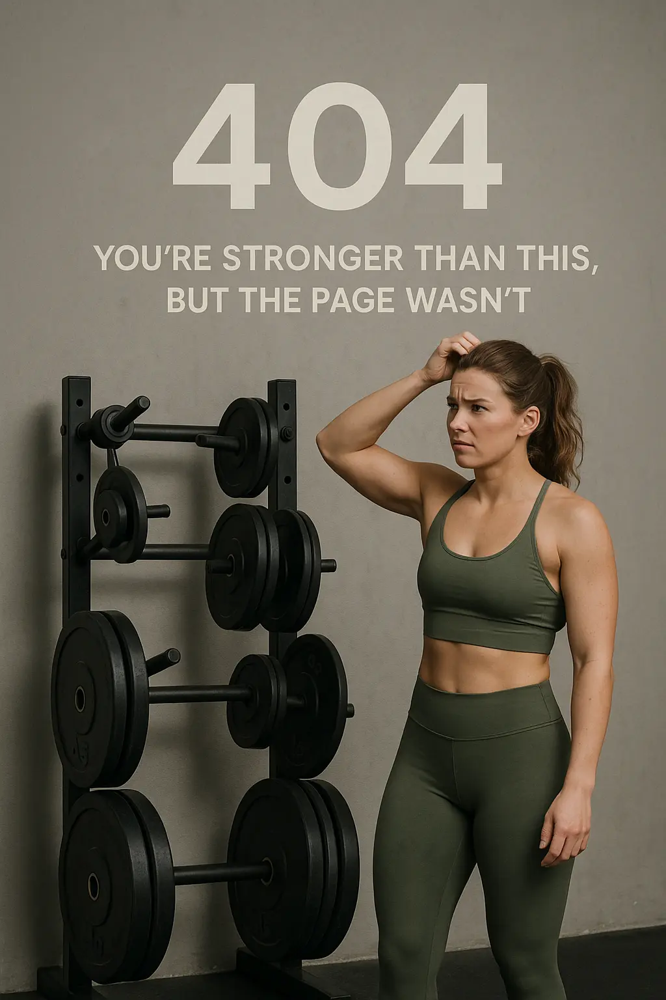

A custom **500-page image** was also created to ensure a professional and cohesive design even during server errors.  The image shows a barbell with one plate fallen off, symbolizing that something has gone wrong, while still matching the project’s color scheme and photorealistic style.  
 

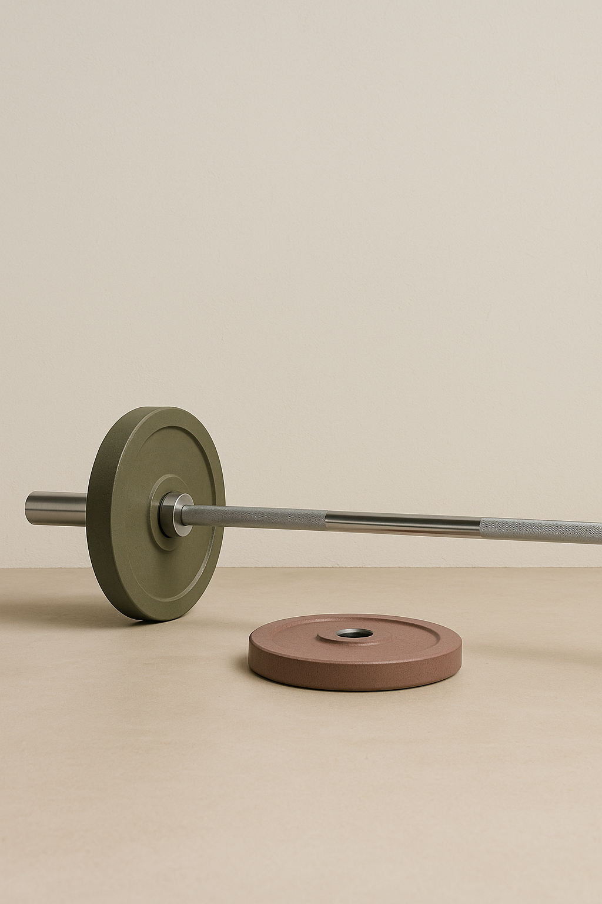

## Wireframes

The wireframes were created early in the process and served mainly as a guideline for how the site could be structured.  
They were helpful in visualizing the general layout and user flows across desktop, tablet, and mobile, but do not represent the final design in detail.  

*Laptop Home and About Us page*

 *Laptop Shop and Product details page*
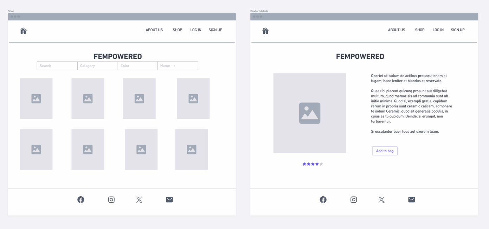

*Tablet Home and About Us page*
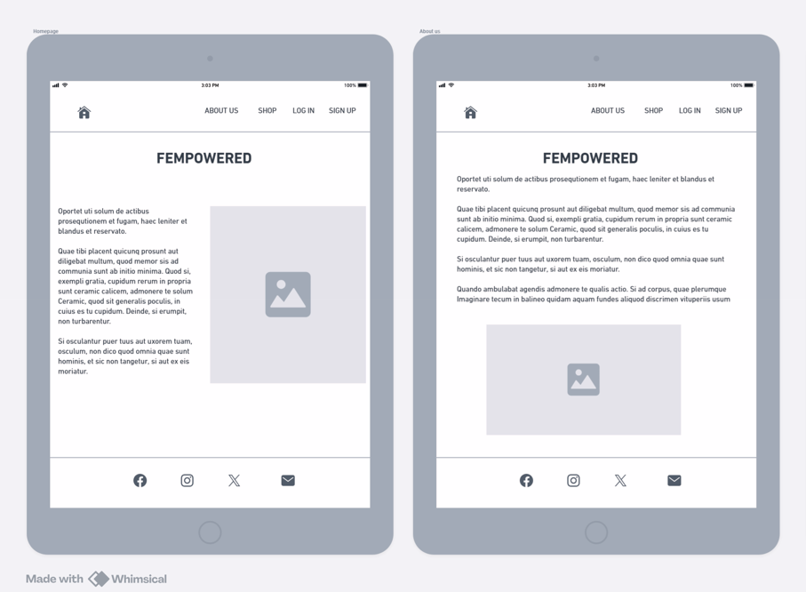

 *Tablet Shop and Product details page*
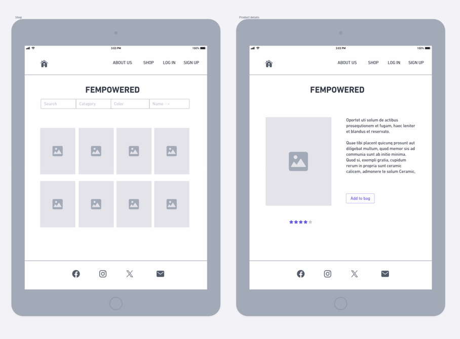

 *Mobile Home, About Us, Shop and Product details page* 
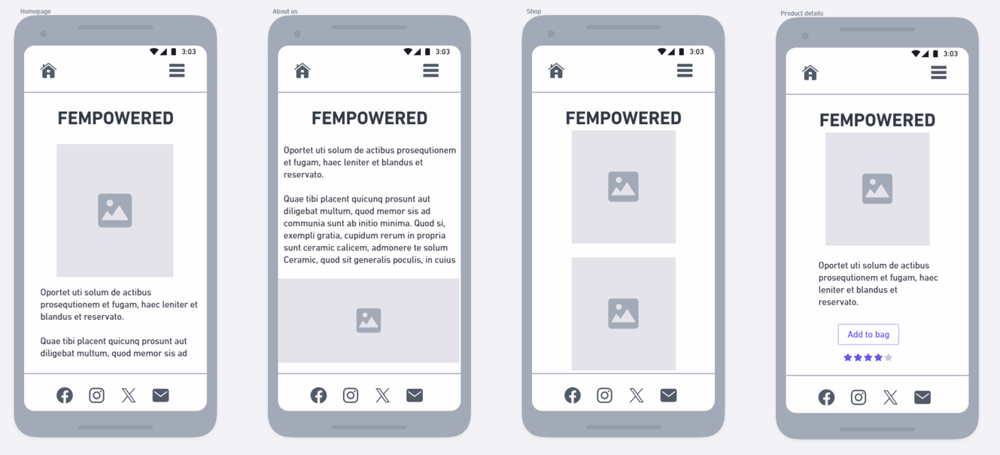 
 
---

## Features  

### Existing Features  

- **Homepage & Navigation**  
  - Hero section introducing the brand and mission.  
  - Responsive navigation bar with links to Shop, About Us, Contact, Account, and Cart.  
  - Footer with social media links and contact information.  

- **Product Catalog**  
  - Products displayed with images, names, and prices.  
  - Each product belongs to a specific **category** (Clothing, Accessories, Equipment), and categories can be used to filter products on the Shop page.  
  - Some products are available in multiple **color variants**, where each variant is listed separately as its own product entry.  
  - Users can click the **heart icon** on a product to mark it as a favorite. Favorited products are stored under the **Favorites** section for easy access.  
  - Clicking a product leads to a **detailed product page** with description, price, available sizes, and reviews.  

- **Filtering & Sorting**  
  - Filter products by category and color.  
  - Search field to quickly find products by name.  
  - Sort products by name (A–Z or Z–A), price (low–high or high–low), and by newest or oldest arrivals.  

- **Shopping Cart & Checkout**  
  - Add products to cart, update quantities, or remove items.  
  - Cart dynamically updates subtotal and shipping costs.  
  - Checkout flow with shipping details, address form, and payment via **Stripe integration**.  
  - Order confirmation page with unique order number.  
  - Nudges encourage users to create an account during checkout (e.g., *“Aren’t you a part of Fempowered yet?”*).  

- **User Authentication & Account Management**  
  - Secure signup, login, and logout powered by **Django Allauth**, with confirmation messages to give users clear feedback.  
  - Email verification for account creation.  
  - Each user can store **one shipping address** and **one billing address**, which can be **created, read, updated, and deleted (CRUD)**.  
  - The **My Account** area allows users to:  
    - View all previously placed orders, with links to detailed order information.  
    - Manage saved addresses.  
      - Address form includes robust validation:
        - **Full name** must contain both first and last name.  
        - **Phone** requires 7–15 digits (with +, spaces, hyphens allowed).  
        - **Postal codes** validated per country:  
          - **SE (Sweden):** exactly 5 digits (e.g., `21145`).  
          - **GB/UK:** validated and normalized (e.g., `SW1A 1AA`).  
          - **Others:** fallback rule of 3–10 digits.  
    - Change the registered email address.  
    - Update their password securely.  
  - Nudges encourage account creation or login at several points:  
    - *“Are you a part of Fempowered yet?”* on the product detail page.  
    - *“Why join Fempowered?”* on the sign-up page.  
    - *“Aren’t you a part of Fempowered yet?”* on the checkout page.  

- **Reviews & Ratings**  
  - Logged-in users can leave a star rating (1–5) and a text review.  
  - Reviews are restricted to users who have purchased the product, and each user can leave **only one review per purchased product**.  
  - Users can **create, read, update, and delete (CRUD)** their own reviews.  
  - The average star rating is displayed on each product page, calculated from all submitted reviews.  

- **Favorites System**  
  - Logged-in users can mark products as favorites directly in the catalog.  
  - Favorited products are saved under the **Favorites** page for easy access.  

- **Contact Form**  
  - A contact form is available for users to get in touch with the site owner.  
  - Includes validation to ensure all required fields are filled in with the correct format.  
  - Once submitted, the message is sent to the site’s configured email address, and the user receives a confirmation that the message was successfully sent.  

- **Responsive Design & Branding**  
  - Fully responsive across desktop, tablet, and mobile devices.  
  - Built with Bootstrap 4 and custom CSS variables (color theme).  
  - About Us page with custom illustration explaining the brand story.  
  - 404 page with a humorous, themed image (*“Lost in the gym”*).  
  - Consistent imagery, typography, and color palette throughout the site.  

### Future Features  

- **Extended Filtering & Sorting**  
  - Filter products by size and highest rating.  
  - Additional sorting options such as popularity or bestsellers.  

- **Newsletter Subscription**  
  - Users can subscribe to receive product updates and promotions.  

- **Social Login**  
  - Option to sign in with Google or Facebook accounts.  

- **Wishlist Expansion**  
  - Allow users to save multiple favorites lists (e.g., “Summer Gear”, “Gift Ideas”).  

- **Admin Enhancements**  
  - Richer dashboard for order analytics and customer insights.  
  - Category management directly in the admin panel for easier product organization. 

### Responsiveness  
The site is fully responsive across devices.  
Below are examples of the Home, Shop, and Product pages on mobile and laptop:

| Page          | Mobile View | Laptop View |
|---------------|-------------|-------------|
| Home          | 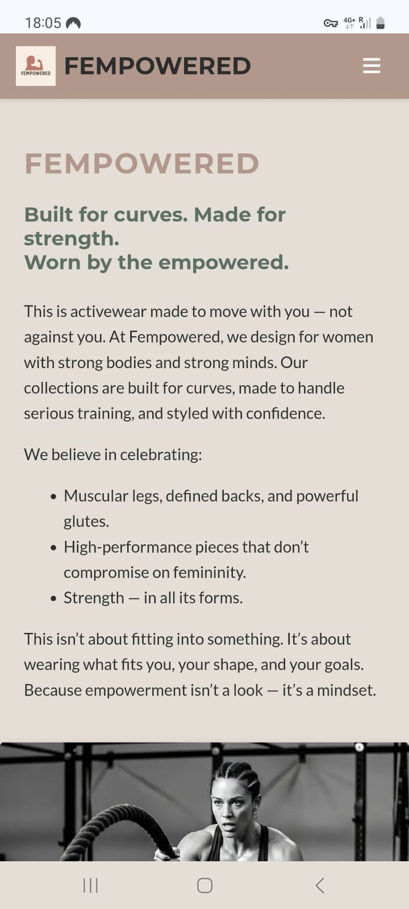 |  |
| Shop          | 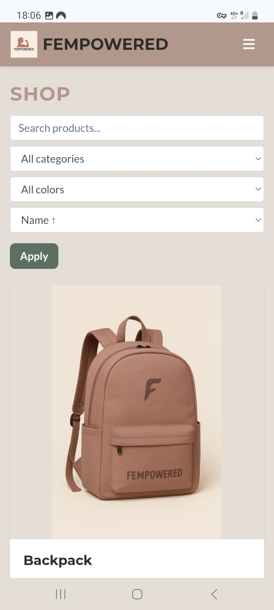 | 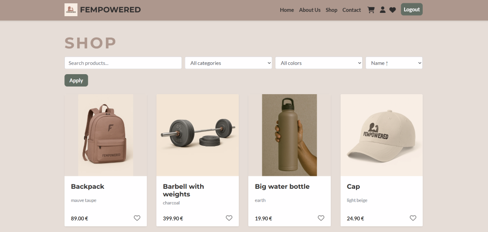 |
| Product       |  | 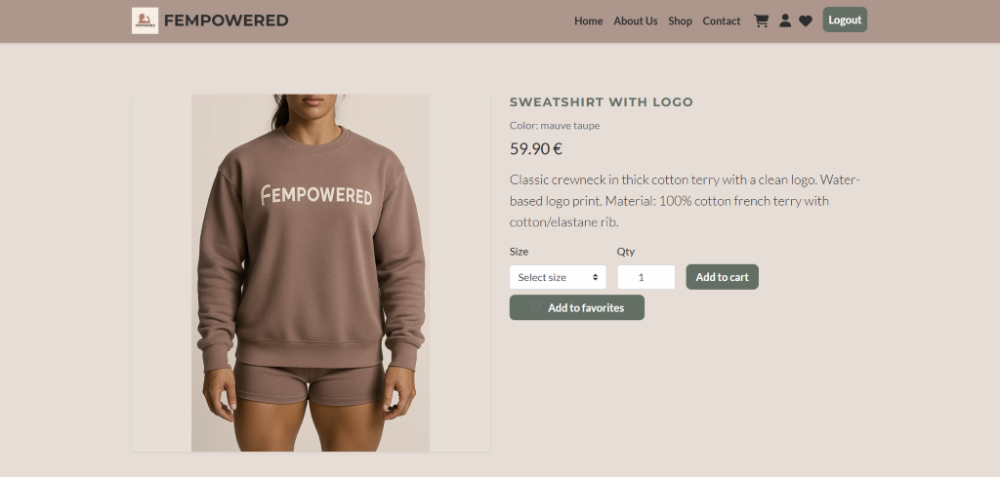 |

---

## Accessibility  

Accessibility has been considered throughout the project to make the site easier to use for everyone. All product and illustration images include **alt-texts**, so that users relying on screen readers can still understand the content. Interactive elements such as the cart, favorites, account, and social media links have been given **ARIA labels** for clearer navigation.  

A **skip-link** was added to support keyboard users, making it possible to jump straight to the main content. The chosen color palette was also checked against **WCAG AA standards** to ensure good contrast and readability across the site.  

---

## Technologies Used  

- **Languages**: Python, JavaScript, HTML5, CSS3  
- **Frameworks**: Django 5.2.5, Bootstrap 4  
- **Database**: SQLite (development), PostgreSQL with psycopg2 (production)  
- **Authentication**: Django Allauth  
- **Deployment**: Heroku, Gunicorn, Whitenoise (static files)  
- **Payment**: Stripe API  
- **Image Management**: Pillow (image handling), CloudConvert (conversion to WebP), Microsoft Photos & Paint (basic editing), Favicon.io (favicon generator)  
- **Version Control**: Git & GitHub  
- **Linting & Testing**: Ruff, Flake8, Django unit tests  
- **Design & Branding**: ChatGPT (AI-generated imagery), Font Awesome (icons)  

 

### Code Quality and DRY Principle

The project follows Django conventions and the DRY (Don't Repeat Yourself) principle:
- Base template (`base.html`) provides shared layout (navbar, footer, messages).
- CSS variables define the global color theme and fonts.
- Reusable forms and partials (e.g. review form, checkout address form) reduce duplication.
- JavaScript for favorites toggle is written once and reused across pages.

This ensures consistency and makes the project easier to maintain.

---

## Database Design  

### Database Schema (ERD)

The diagram below shows the database structure and how the models relate to each other.   

*Diagram created in Lucidchart.*

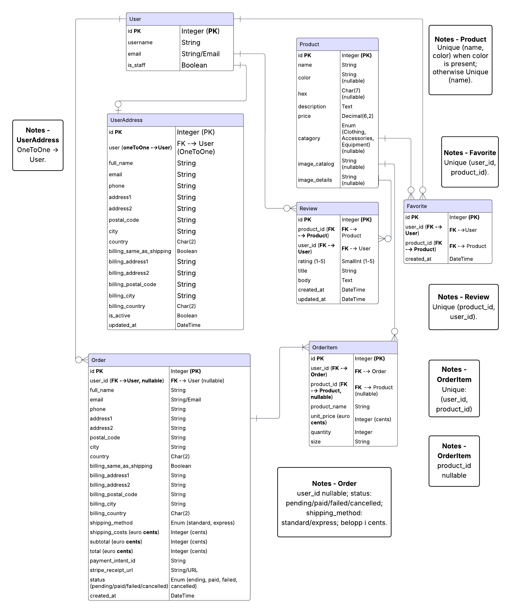

**Relationship notation:**  
- `1 — 1` : One-to-One  
- `1 — *` : One-to-Many  
- `* — *` : Many-to-Many    
*(“O” indicates optional — **zero**; e.g., `O—*` = zero-to-many.)*

**Relationships:**
- One **User** can have `0..*` **Orders** (guest checkout means an Order may have no User).  
- One **Order** contains `1..*` **OrderItems**; each OrderItem belongs to exactly one Order.  
- One **Product** can appear in `0..*` **OrderItems**; each OrderItem may reference `0..1` Product (FK is nullable).  
- One **User** can write `0..*` **Reviews**; each Review belongs to **one Product** and **one User**.  
  *(Constraint: one review per user & product.)*  
- **Favorites** represent a `* — *` between Users and Products via the **Favorite** join table (unique pair of user_id + product_id).  
- **UserAddress** is `1 — 0..1` with User (one optional address per user).  
- **Product.category** is a **choice/enum value**, not a foreign key to a Category table.

---

## Testing  
Full testing documentation (manual and automated) is available in [TESTING.md](TESTING.md).
### Validation  
- HTML and CSS validated with W3C tools  
- Python code linted with Ruff/Flake8  
- JavaScript validated with JSHint 
### Manual Testing  
- Browsers: Chrome, Edge, Firefox  
- Devices: desktop, tablet, mobile  
- All key user stories tested manually  
### Automated Testing  
- Unit tests written for forms (checkout validation, reviews)  
- Coverage reported with Django’s test framework  

### Test Results Summary
- All critical flows (product browsing, cart updates, checkout, reviews, authentication) passed locally and on Heroku.  
- **Admin CRUD:** Verified full create/read/update/delete for the **Product** model in Django Admin, including category assignment and list filtering.  
- **User stories:** All Must-have and most Should-have stories passed. For **User Story 20 (manage product categories)**, full category CRUD in Admin is **deferred**; the MVP outcome (assigning a predefined category and filtering by category) was verified.  
- Automated tests (forms and views) passed with Django’s test runner; no blocking issues were found.

### Note on TDD  
The project was not developed using a strict Test-Driven Development (TDD) methodology. Instead, features were built iteratively and tested afterwards through both manual and automated tests. This approach was chosen as it allowed rapid prototyping of features before focusing on testing and validation.

---

## Deployment   

This Django project was deployed using **Heroku** with GitHub integration for deployment. Below is an overview of the steps taken to get the app live:

### 1. Create the Heroku App
I logged into my Heroku dashboard and created a new app by clicking **"New" > "Create new app"**. I chose a unique app name and selected the region **Europe**.

### 2. Connect to GitHub
Under the **Deploy** tab in Heroku, I connected my GitHub account and selected the repository for this project.

### 3. Manual Deployment from GitHub
Instead of automatic deployment, I used **manual deployment** through the Heroku dashboard. After pushing changes to the main branch on GitHub, I go to the **Deploy** tab in Heroku and click **Deploy Branch** to publish the latest version of the app.

### 4. Set Environment Variables
In the **Settings** tab, under **Config Vars**, I added the necessary environment variables to match those used locally in the `.env` file:  

- `SECRET_KEY` – Django secret key  
- `DATABASE_URL` – connection string for the production database (Heroku Postgres)  
- `STRIPE_PUBLIC_KEY`  
- `STRIPE_SECRET_KEY`  
- `STRIPE_WH_SECRET`  
- `EMAIL_HOST_USER`  
- `EMAIL_HOST_PASSWORD`  
- `DEFAULT_FROM_EMAIL`  
- `DEBUG` set to `False`  
- `DISABLE_COLLECTSTATIC=1` used during early deployment before static files were configured  

These variables ensure security and correct configuration between local and production environments.

### 5. Buildpacks & Procfile
In the **Settings** tab, I added the **Python buildpack** (`heroku/python`).  
A **Procfile** was also added to the project root with the following line:  
`web: gunicorn fempowered.wsgi`  

This tells Heroku to use Gunicorn to run the Django application.

### 6. Database & Migrations
After connecting to Postgres, I ran:  
`python manage.py migrate` 
to set up the database schema in production.

### 7. Static Files
Heroku automatically runs the following command on each deployment to gather static files (CSS, JavaScript, images):  
`python manage.py collectstatic`  
Static files are served in production using **Whitenoise**.

### 8. Test the Live App
Finally, I clicked **"Open app"** in Heroku to confirm that the site was deployed and functioning correctly.  

👉 The live app is available here:  
[FEMPOWERED](https://fempowered-bf915cb8a046.herokuapp.com)  

---

### 🔄 How to clone the repository
1. From the repository page, click the green **Code** button.  
2. Choose HTTPS and copy the link.  
3. Open your IDE and run:  
`git clone <copied-url>`

4. Navigate into the project folder and install requirements:  
`pip install -r requirements.txt`
5. Create a `.env` file and add your own environment variables.  
6. Run the server with:  
`python manage.py runserver`

### 🍴 How to fork the repository
1. On the repository page, click the **Fork** button (top right).  
2. This will create a copy of the repository under your own GitHub account.  

---
## Credits & Acknowledgements

**Learning resources & walkthroughs**
- Code Institute — *“Boutique Ado”* e-commerce walkthrough (videos + reference code): [codeinstitute.net](https://codeinstitute.net/)
- Codecademy — *Build Python Web Apps with Django* Skill Path: [codecademy.com](https://www.codecademy.com/learn/paths/build-python-web-apps-with-django)

**YouTube channels that informed patterns & architecture**
- [freeCodeCamp.org](https://www.youtube.com/c/Freecodecamp) — full-stack Django/React e-commerce content
- [JustDjango](https://www.youtube.com/@JustDjango) — Django e-commerce (incl. React/Next.js integrations)
- [Dennis Ivy](https://www.youtube.com/@DennisIvy) — end-to-end Django e-commerce playlist (cart, auth, payments)
- [Very Academy](https://www.youtube.com/@veryacademy) — Django e-commerce series (incl. Stripe/PayPal, DRF)
- [CodingEntrepreneurs](https://www.youtube.com/@CodingEntrepreneurs) — Stripe + Django and open-source e-com examples

**Documentation & references**
- [Django docs](https://docs.djangoproject.com/en/stable/)
- [Stripe docs](https://stripe.com/docs)
- [Bootstrap docs](https://getbootstrap.com/docs/)
- [WhiteNoise docs](https://whitenoise.evans.io/en/stable/)
- [Heroku Dev Center](https://devcenter.heroku.com/)

**Communities**
- Code Institute **Slack** and **Discord**. Discord is replacing Slack, but not all content has migrated yet. Most of my research and discussion for this project happened on Slack.

**Acknowledgements**
- My mentor and the Code Institute community for guidance and reviews.  
- Friends and family for brutally honest feedback and manual-testing help — which led to more work, late nights, and a few headaches — and, ultimately, a better project.
