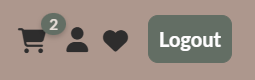
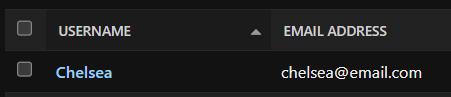

# Testing Documentation

## Table of Contents
- [Automated Testing](#automated-testing)
- [Manual Testing](#manual-testing)
  - [User Stories](#user-stories)
  - [Navigation and Links](#navigation-and-links)
  - [Buttons](#buttons)
  - [Forms](#forms)
  - [Error Handling](#error-handling)
  - [Authentication](#authentication)
  - [General UX](#general-ux)
  - [Account Address Form](#account-address-form)
- [Validation](#validation)
- [Bugs and Fixes](#bugs-and-fixes)
---

## Automated Testing
All automated tests were executed module by module during development, using the Django test runner. Each test file was run individually with commands such as:

`python manage.py test checkout.tests.test_forms -v 2`   
`python manage.py test checkout.tests.test_views -v 2`   
`python manage.py test shop.tests.test_models -v 2`

### Checkout Form Tests
Unit tests for the `CheckoutAddressForm` are located in `checkout/tests/test_forms.py`.  
The tests verify that the form enforces key validation rules:
- **Full name**: must contain both first and last name.
- **Phone number**: must be sufficiently long and contain only valid characters.
- **Postal code**: must consist of digits only.
- **Billing fields**: required when billing address is not the same as shipping.

**Result:**  
All validation rules worked as expected. The tests passed successfully ✔

---
### Account Address Form Tests
Unit tests for the `UserAddressForm` are located in `accounts/tests/test_forms.py`.  
These tests cover the account “My Address” page, ensuring that both shipping and billing addresses are validated correctly.

The tests verify that the form enforces:
- **Full name**: must include both first and last name.  
- **Phone number**: must contain 7–15 digits (with `+`, spaces, and hyphens allowed).  
- **Postal codes**:  
  - **SE (Sweden):** exactly 5 digits (e.g., `21145`).  
  - **GB/UK:** validated against official postcode formats and normalized (e.g., `SW1A 1AA`).  
  - **Other countries:** fallback rule of 3–10 digits.  
- **Billing fields**: required when *billing_same_as_shipping* is unchecked, but optional when it is checked.  

**Result:**  
All account form tests passed successfully ✔

---

### Remaining Automated Tests

All other automated tests are summarized in the table below:

| **Test Category**          | **Location**                                         | **Purpose**                                              | **Result** |
|----------------------------|------------------------------------------------------|----------------------------------------------------------|------------|
| Checkout Views             | `checkout/tests/test_views.py`                       | Address page GET/POST, billing requirements, redirects   | ✅ |
| Checkout Payment & Success | `checkout/tests/test_payment_views.py` `checkout/tests/test_success_view.py` | Payment page loads, success message/page works           | ✅ |
| Checkout Flow (E2E)        | `checkout/tests/test_checkout_flow.py`               | Simulates full checkout flow (address → payment)         | ✅ |
| Shop Models                | `shop/tests/test_models.py`                          | `__str__` methods for Product, Category, Review          | ✅ |
| Shop Views                 | `shop/tests/test_views.py` `shop/tests/test_product_list_smoke.py` | Product listing, search/filter, pagination               | ✅ |
| Cart Views                 | `shop/tests/test_cart_views.py`                      | Cart integration with session                            | ✅ |
| Smoke Tests                | `project_tests/test_smoke.py`                        | Key routes (home, shop, cart, checkout, auth)            | ✅ |
| URL Resolution             | `project_tests/test_urls.py`                         | All named URLs resolve correctly                         | ✅ |
| Authentication Views       | `project_tests/test_auth_views_smoke.py`             | Login, signup, password reset views                      | ✅ |
| Password Reset Email       | `project_tests/test_password_reset_email.py`         | Email sent when triggering password reset                | ✅ |
| Admin Site                 | `project_tests/test_admin_smoke.py`                  | Admin login + index + model changelists                  | ✅ |
| CSRF Tokens                | `project_tests/test_csrf_smoke.py`                   | Confirms CSRF tokens present on key forms                | ✅ |
| Error Pages                | `project_tests/test_error_pages.py`                  | Custom 404 + 500 templates render                        | ✅ |

## Manual Testing

In addition to automated unit tests, all key features of the site were manually tested in the deployed environment.  
The goal was to confirm that navigation, forms, authentication flows, and error handling work as expected from a user’s perspective.  

Testing was performed on both desktop and mobile devices, using Chrome and Microsoft Edge.  
Each section below summarizes the scenarios and expected outcomes. Detailed field-level validation (e.g., for the Account Address form) is included separately where relevant.

---

### User Stories

All user stories were tested manually in the deployed environment.  
Each story includes acceptance criteria in table format with **Steps to Test**, **Expected Outcome**, **Result**, and a column for **Screenshots**.

This ensures that every feature was validated from a user’s perspective, complementing the automated test coverage.

#### User Story 1  
**As a Visitor, I want to browse available products so that I can explore what the shop offers without needing an account.**

**Category:** Must Have  

| Acceptance Criteria | Steps to Test | Expected Outcome | Result | Screenshot |
|----------------------|---------------|------------------|--------|------------|
| User can view all products on a products page without logging in | Navigate to Shop | All products display with image, name, price | ✅ |  |

---

#### User Story 2  
**As a Visitor, I want to view product details so that I can learn more before deciding to buy.**

**Category:** Must Have  

| Acceptance Criteria | Steps to Test | Expected Outcome | Result | Screenshot |
|----------------------|---------------|------------------|--------|------------|
| Clicking a product opens a product detail page with image, description, price | In the Shop, click on a product | Product detail page loads and shows correct product data. Each color variant is listed as a separate product. | ✅ |  |

---

#### User Story 3  
**As a Visitor, I want to search and filter products so that I can quickly find what I'm looking for.**

**Category:** Should Have  

| Acceptance Criteria | Steps to Test | Expected Outcome | Result | Screenshot |
|----------------------|---------------|------------------|--------|------------|
| Search bar returns relevant products | Enter keyword (e.g., "tank") in search bar | Only matching products are displayed | ✅ |  |
| Filters narrow down results by category and color | Use filter dropdowns on product list | Products update dynamically based on filter. Note: size filter is not implemented. | ✅ |  |

---

#### User Story 4  
**As a Visitor, I want to add items to a shopping cart so that I can build my order before checking out.**

**Category:** Must Have  

| Acceptance Criteria | Steps to Test | Expected Outcome | Result | Screenshot |
|----------------------|---------------|------------------|--------|------------|
| Items remain in cart during session | Add product to cart, reload page | Cart still contains product | ✅ |  |
| Cart icon updates with quantity | Add multiple products | Cart badge increments accordingly | ✅ |  |

---

#### User Story 5  
**As a Visitor, I want to be prompted to sign up or log in so that I can proceed to checkout.**

**Category:** Must Have  

| Acceptance Criteria | Steps to Test | Expected Outcome | Result | Screenshot |
|----------------------|---------------|------------------|--------|------------|
| Customer is encouraged to log in or register | Add product to cart, proceed to checkout while logged out | Checkout works as guest, but login/signup prompts are displayed on product detail, signup, and checkout pages | ✅ |  |

---

#### User Story 6  
**As a Registered User, I want to register an account so that I can make purchases and track orders.**

**Category:** Must Have  

| Acceptance Criteria | Steps to Test | Expected Outcome | Result | Screenshot |
|----------------------|---------------|------------------|--------|------------|
| Registration form with validation | Navigate to signup page, submit invalid and valid data | Errors shown for invalid, success redirect for valid | ✅ |  |
| Success message shown after registration | Register with valid credentials | Confirmation message appears | ✅ |  |
| User stored in database | Register and check admin panel | User appears in database | ✅ |  |

---

#### User Story 7  
**As a Registered User, I want to log in and log out securely so that I can access and protect my data.**

**Category:** Must Have  

| Acceptance Criteria | Steps to Test | Expected Outcome | Result | Screenshot |
|----------------------|---------------|------------------|--------|------------|
| User can log in and log out | Login with valid account, then log out | Login successful, logout ends session | ✅ |  |
| Session ends on logout | Logout and try accessing My Account | My Account is not accessible when logged out (compare image with **7.3**) | ✅ |  |
| Protected pages require login | Access `/accounts/orders/` while logged out | Redirected to login (My Account is not available for logged-out users) | ✅ |  |

---

#### User Story 8  
**As a Registered User, I want to view my order history so that I can keep track of past purchases.**

**Category:** Should Have  

| Acceptance Criteria | Steps to Test | Expected Outcome | Result | Screenshot |
|----------------------|---------------|------------------|--------|------------|
| Orders are linked to user accounts | Place order, then login and check My Account → Orders | Orders displayed under user account | ✅ |  |
| Orders are displayed in profile | View Orders page | Order list with details (number, date, total) displayed correctly | ✅ |  |

---

#### User Story 9  
**As a Registered User, I want to leave product reviews so that I can share feedback with others.**

**Category:** Should Have  

| Acceptance Criteria | Steps to Test | Expected Outcome | Result | Screenshot |
|----------------------|---------------|------------------|--------|------------|
| Review form visible to logged-in users | Visit product page as logged-in user | Review form is visible | ✅ |  |
| Reviews stored and displayed under products | Submit review | Review appears under product detail | ✅ |  |

---

#### User Story 10  
**As a Registered User, I want to edit or delete my own reviews so that I can manage my contributions.**

**Category:** Should Have  

| Acceptance Criteria | Steps to Test | Expected Outcome | Result | Screenshot |
|----------------------|---------------|------------------|--------|------------|
| User can edit or delete only their own reviews | Login as review owner, try edit/delete | Edit/delete allowed | ✅ |  |
| Changes update instantly | Edit review → refresh page | Updated text is displayed | ✅ |  |

---

#### User Story 11  
**As a Registered User, I want to trust that my personal data is handled securely so that I feel safe using the platform.**

**Category:** Could Have  

| Acceptance Criteria | Steps to Test | Expected Outcome | Result | Screenshot |
|----------------------|---------------|------------------|--------|------------|
| HTTPS enabled | Visit deployed site | Site loads with HTTPS (padlock visible) | ✅ |  |
| Secure password storage | Inspect database (via admin) | Passwords stored as hashes | ✅ |  |
| API keys and secrets are hidden | Check GitHub repo | No secrets visible in code | ✅ |  |
| GDPR compliance | Review site behavior | User data not exposed; only minimal personal data stored | ✅ |  |

---

#### User Story 12  
**As a Customer, I want to add and remove products from the cart so that I can manage my order.**

**Category:** Must Have  

| Acceptance Criteria | Steps to Test | Expected Outcome | Result | Screenshot |
|----------------------|---------------|------------------|--------|------------|
| Cart updates instantly when items are added/removed | Add/remove product from cart | Cart page updates totals immediately | ✅ |  |

---

#### User Story 13  
**As a Customer, I want to view a cart summary with totals so that I know what I’m about to pay.**

**Category:** Must Have  

| Acceptance Criteria | Steps to Test | Expected Outcome | Result | Screenshot |
|----------------------|---------------|------------------|--------|------------|
| Cart page shows product names, quantities, subtotals, and total | Go to Cart page after adding items | Correct products and totals displayed | ✅ |  |

---

#### User Story 14  
**As a Customer, I want to go to checkout and enter shipping details so that my order can be delivered.**

**Category:** Must Have  

| Acceptance Criteria | Steps to Test | Expected Outcome | Result | Screenshot |
|----------------------|---------------|------------------|--------|------------|
| Checkout form collects name, address, and contact details | Proceed to checkout, fill form | Form saves valid data | ✅ |  |
| Shipping info saved to order | Place order and check admin/order history | Shipping data saved to order | ✅ |  |

---

#### User Story 15  
**As a Customer, I want to pay securely via Stripe so that I can complete my purchase safely.**

**Category:** Must Have  

| Acceptance Criteria | Steps to Test | Expected Outcome | Result | Screenshot |
|----------------------|---------------|------------------|--------|------------|
| Stripe integration for secure payments | Complete checkout with test card | Stripe payment succeeds | ✅ |  |
| Payment success/fail handled | Try both valid and declined card | Success message shown or error displayed | ✅ |  |

---

#### User Story 16  
**As a Customer, I want to receive a confirmation message after a successful payment so that I know the order went through.**

**Category:** Must Have  

| Acceptance Criteria | Steps to Test | Expected Outcome | Result | Screenshot |
|----------------------|---------------|------------------|--------|------------|
| Success confirmation displayed | Complete order with valid payment | Confirmation message displayed with order details | ✅ |  |

---

#### User Story 17  
**As a Customer, I want to see helpful error messages on failed payments so that I know how to fix issues.**

**Category:** Could Have  

| Acceptance Criteria | Steps to Test | Expected Outcome | Result | Screenshot |
|----------------------|---------------|------------------|--------|------------|
| Failed payment message explains the error and offers retry | Use declined Stripe test card | Error message shown with retry option | ✅ |  |

---

#### User Story 18  
**As an Admin, I want to log in to the admin panel so that I can manage the shop backend.**

**Category:** Must Have  

| Acceptance Criteria | Steps to Test | Expected Outcome | Result | Screenshot |
|----------------------|---------------|------------------|--------|------------|
| Admin login page | Navigate to `/admin/` | Admin login form loads | ✅ |  |
| Access restricted to staff accounts | Attempt login with non-staff user | Access denied | ✅ |  |

---

#### User Story 19  
**As an Admin, I want to add, update, and delete products so that I can keep the catalogue current.**

**Category:** Must Have  

| Acceptance Criteria | Steps to Test | Expected Outcome | Result | Screenshot |
|----------------------|---------------|------------------|--------|------------|
| CRUD operations for products in admin panel | Login as staff → manage products in admin | Products can be added, updated, deleted | ✅ |  |

---

#### User Story 20  
**As an Admin, I want to manage product categories so that items are well organized.** 

**Category:** Should Have  

> **Scope clarification (MVP):** Categories are predefined **choices** on `Product.category`. In Admin, you can **assign** a category to a product and **filter** by category. **Creating, editing, or deleting categories in Admin is not part of this release** and is planned for a later iteration.

| Acceptance Criteria | Steps to Test | Expected Outcome | Result | Screenshot |
|---|---|---|---|---|
| Categories can be created, edited, and deleted in Admin | Admin → (would be) Categories | Categories created/edited/deleted successfully | ⏭ Deferred (out of MVP scope) | – |

---

**MVP Validation**  
| What is validated | Steps to Test | Expected Outcome | Result | Screenshot |
|---|---|---|---|---|
| Assign predefined category to a product and filter by category in Admin | Admin → Products → open a product → choose **Category** (dropdown) → **Save**. Then go to Products list and use **By category** filter | Product saves with the selected category, list filters correctly | ✅  |   |

---

#### User Story 21  
**As an Admin, I want to view incoming orders and their details so that I can fulfill them efficiently.**

**Category:** Must Have  

| Acceptance Criteria | Steps to Test | Expected Outcome | Result | Screenshot |
|----------------------|---------------|------------------|--------|------------|
| Orders listed in admin | Login as staff → Orders | Orders displayed with order numbers | ✅ |  |
| Order detail view shows customer/shipping info | Open order in admin | Order details shown | ✅ |  |

---

#### User Story 22  
**As an Admin, I want to mark orders as fulfilled or shipped so that customers stay informed.**

**Category:** Must Have  

| Acceptance Criteria | Steps to Test | Expected Outcome | Result | Screenshot |
|----------------------|---------------|------------------|--------|------------|
| Order status can be updated in admin | Login as staff → update order status | Status updates saved and visible | ✅ |  |

---

#### User Story 23  
**As an Admin, I want to restrict access to admin-only features so that only authorized staff can manage content.**

**Category:** Must Have  

| Acceptance Criteria | Steps to Test | Expected Outcome | Result | Screenshot |
|----------------------|---------------|------------------|--------|------------|
| Admin pages require staff login | Attempt to access admin as non-staff | Access denied | ✅ |  |

**Summary:**  

All user stories were manually tested against their acceptance criteria. All **Must-have** and most **Should-have** stories passed ✅

For **User Story 20**, the acceptance criterion “Categories can be created, edited, and deleted in Admin” is **Deferred (out of MVP scope)**; the MVP behavior—assigning a predefined category to a product and filtering by category, was verified and passed. 

---

### Navigation and Links
- ✅ Navbar links (Home, Shop, Cart, Account, Contact) all lead to the correct page.  
- ✅ Footer links navigate correctly.  
- ✅ Logo is clickable and returns to the homepage. 
---

### Buttons
- ✅ Add to Cart works and updates the cart counter.  
- ✅ Update Cart adjusts product quantities correctly.  
- ✅ Checkout button leads to the address step.  
- ✅ Favorite/like heart requires login (redirects to login page if not authenticated).  
- ✅ Login/Logout buttons show the correct state depending on authentication. 

---
### Forms
- ✅ Contact form validates fields and can be submitted successfully.  
- ✅ Search/filter in Shop displays correct product results.  
- ✅ Review form requires login and validates rating + body input.  
- ✅ Checkout form validates required fields and billing rules.  
- ✅ Account Address form tested separately (see section above).

---
### Error Handling
- ✅ Custom 404 page displays for invalid URLs.  

---
### Authentication
- ✅ Signup works with email verification.  
- ✅ Login works with valid credentials.  
- ✅ Logout logs the user out and displays a confirmation message.  
- ✅ Password reset flow sends an email and accepts new password. 

---
### General UX
- ✅ Site is responsive on mobile, tablet, and desktop.  
- ✅ CSRF token present in all forms.  
- ✅ Django messages appear consistently (e.g., on login, logout, save, delete). 

---

### Account Address Form

The address form was manually tested to ensure correct validation and behavior.

| Scenario | Steps to Test | Expected Outcome | Result |
|---|---|---|---|
| SE valid | Enter Country=`SE`, Postal=`21145`, fill other required fields | Saved successfully, postal normalized to `21145`. | ✅ |
| SE invalid | Enter Country=`SE`, Postal=`123` | Error: “Swedish postal code must be exactly 5 digits.” | ✅ |
| UK valid | Enter Country=`GB`, Postal=`SW1A1AA` | Saved successfully, normalized to `SW1A 1AA`. | ✅ |
| UK invalid | Enter Country=`GB`, Postal=`12345` | Error: “Enter a valid UK postcode.” | ✅ |
| Fallback valid | Enter Country=`DE`, Postal=`12345` | Accepted (fallback 3–10 digits). | ✅ |
| Billing required | Uncheck *same as shipping*, leave billing empty | Errors on billing fields. | ✅ |
| Billing valid | Uncheck *same as shipping*, fill billing address | Saved successfully. | ✅ |
| Delete flow | Click **Delete** on saved address | Address soft-deleted, form cleared. | ✅ |

**Result:**  
All tested scenarios behaved as expected. Both frontend (UI disabling of billing fields) and backend validation (SE/UK-specific) worked consistently.

---
### Validation

---
### Bugs and Fixes
