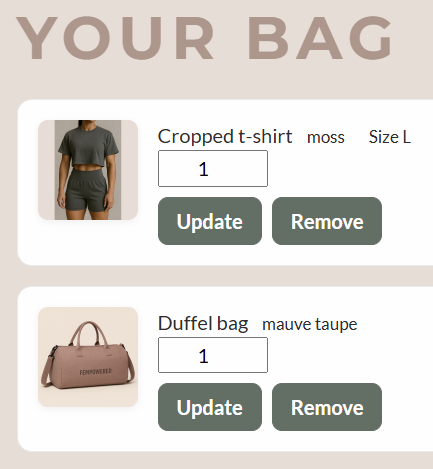
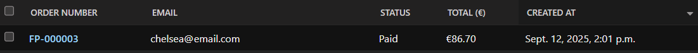
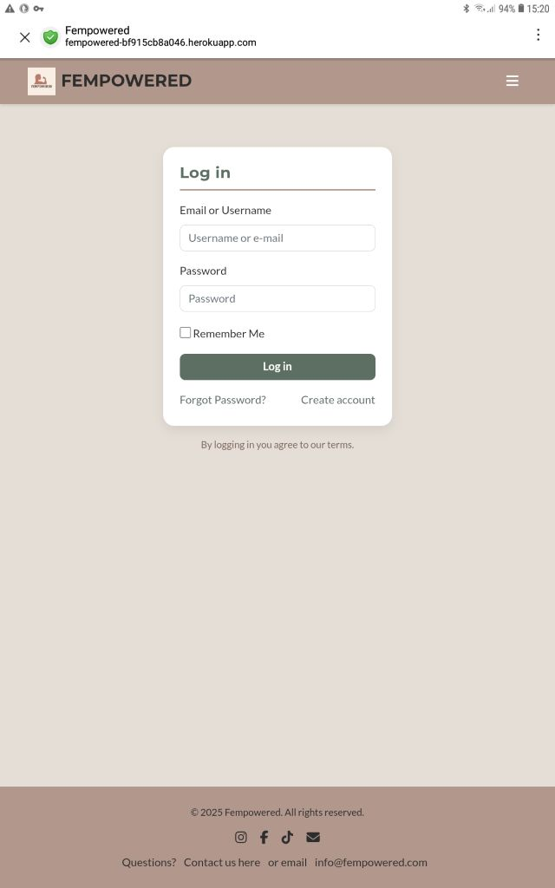

# Testing Documentation

## Table of Contents
- [Automated Testing](#automated-testing)
- [Manual Testing](#manual-testing)
  - [User Stories](#user-stories)
  - [Navigation and Links](#navigation-and-links)
  - [Buttons](#buttons)
  - [Forms](#forms)
  - [Error Handling](#error-handling)
  - [Authentication](#authentication)
  - [General UX](#general-ux)
  - [Account Address Form](#account-address-form)
  - [Responsiveness](#responsiveness)
- [Bugs and Fixes](#bugs-and-fixes)

---

> Validation results (HTML, CSS) and Lighthouse reports are included in the **README** under the [Validation](README.md#validation) section.

## Automated Testing
All automated tests were executed module by module during development, using the Django test runner.  
Each test file was run individually with commands such as:

```bash
python manage.py test checkout.tests.test_forms -v 2
python manage.py test checkout.tests.test_views -v 2
python manage.py test shop.tests.test_models -v 2
```


### Checkout Form Tests
Unit tests for the `CheckoutAddressForm` are located in `checkout/tests/test_forms.py`.  
The tests verify that the form enforces key validation rules:
- **Full name**: must contain both first and last name  
- **Phone number**: must be sufficiently long and contain only valid characters  
- **Postal code**: validated according to country code  
  - `SE`: must follow Swedish format (NNN NN)  
  - `GB` / `UK`: must follow UK postal code format  
  - Other countries: fallback rule of 3–10 digits 
- **Billing fields**: required when billing address is not the same as shipping  

**Result:**  
All validation rules worked as expected. The tests passed successfully ✅  


---

### Account Address Form Tests
Unit tests for the `UserAddressForm` are located in `accounts/tests/test_forms.py`.  
These tests cover the account “My Address” page, ensuring that both shipping and billing addresses are validated correctly.

The tests verify that the form enforces:
- **Full name**: must include both first and last name  
- **Phone number**: must contain 7–15 digits (with `+`, spaces, and hyphens allowed)  
- **Postal codes**:  
  - **SE (Sweden):** exactly 5 digits (e.g., `21145`)  
  - **GB/UK:** validated against official postcode formats and normalized (e.g., `SW1A 1AA`)  
  - **Other countries:** fallback rule of 3–10 digits  
- **Billing fields**: required when *billing_same_as_shipping* is unchecked, but optional when it is checked  

**Result:**  
All account form tests passed successfully ✅

---

### Remaining Automated Tests

| **Test Category**          | **Location**                                         | **Purpose**                                              | **Result** |
|-----------------------------|------------------------------------------------------|----------------------------------------------------------|------------|
| Checkout Views              | `checkout/tests/test_views.py`                       | Address page GET/POST, billing requirements, redirects   | ✅ |
| Checkout Payment & Success  | `checkout/tests/test_payment_views.py`<br>`checkout/tests/test_success_view.py` | Payment page loads, success message/page works           | ✅ |
| Checkout Flow (E2E)         | `checkout/tests/test_checkout_flow.py`               | Simulates full checkout flow (address → payment)         | ✅ |
| Shop Models                 | `shop/tests/test_models.py`                          | `__str__` methods for Product, Category, Review          | ✅ |
| Shop Views                  | `shop/tests/test_views.py`<br>`shop/tests/test_product_list_smoke.py` | Product listing, search/filter, pagination               | ✅ |
| Cart Views                  | `shop/tests/test_cart_views.py`                      | Cart integration with session                            | ✅ |
| Smoke Tests                 | `project_tests/test_smoke.py`                        | Key routes (home, shop, cart, checkout, auth)            | ✅ |
| URL Resolution              | `project_tests/test_urls.py`                         | All named URLs resolve correctly                         | ✅ |
| Authentication Views        | `project_tests/test_auth_views_smoke.py`             | Login, signup, password reset views                      | ✅ |
| Password Reset Email        | `project_tests/test_password_reset_email.py`         | Email sent when triggering password reset                | ✅ |
| Admin Site                  | `project_tests/test_admin_smoke.py`                  | Admin login + index + model changelists                  | ✅ |
| CSRF Tokens                 | `project_tests/test_csrf_smoke.py`                   | Confirms CSRF tokens present on key forms                | ✅ |
| Error Pages                 | `project_tests/test_error_pages.py`                  | Custom 404 + 500 templates render                        | ✅ |

---

## Manual Testing

In addition to automated unit tests, all key features of the site were manually tested in the deployed environment.  
The goal was to confirm that navigation, forms, authentication flows, and error handling work as expected from a user’s perspective.  

Testing was performed on both desktop, tablets and mobile devices, using Chrome, Microsoft Edge, Safari and Firefox.  
Each section below summarizes the scenarios and expected outcomes. Detailed field-level validation (e.g., for the Account Address form) is included separately where relevant.

---

### User Stories

All user stories were tested manually in the deployed environment.  
Each story includes acceptance criteria in table format with **Steps to Test**, **Expected Outcome**, **Result**, and a column for **Screenshots**.

This ensures that every feature was validated from a user’s perspective, complementing the automated test coverage.

#### User Story 1  
**As a Visitor, I want to browse available products so that I can explore what the shop offers without needing an account.**

**Category:** Must have  

| Acceptance Criteria | Steps to Test | Expected Outcome | Result | Screenshot |
|---------------------|---------------|------------------|--------|------------|
| User can view all products on a products page without logging in | Navigate to Shop | All products display with image, name, price | ✅ |  |

---

#### User Story 2  
**As a Visitor, I want to view product details so that I can learn more before deciding to buy.**

**Category:** Must-have  

| Acceptance Criteria | Steps to Test | Expected Outcome | Result | Screenshot |
|---------------------|---------------|------------------|--------|------------|
| Clicking a product opens a product detail page with image, description, price | In the Shop, click on a product | Product detail page loads and shows correct product data. Each color variant is listed as a separate product. | ✅ |  |

---

#### User Story 3  
**As a Visitor, I want to search and filter products so that I can quickly find what I'm looking for.**

**Category:** Should Have  

| Acceptance Criteria | Steps to Test | Expected Outcome | Result | Screenshot |
|----------------------|---------------|------------------|--------|------------|
| Search bar returns relevant products | Enter keyword (e.g., "tank") in search bar | Only matching products are displayed | ✅ |  |
| Filters narrow down results by category and color | Use filter dropdowns on product list | Products update dynamically based on filter. Note: size filter is not implemented. | ✅ |  |

---

#### User Story 4  
**As a Visitor, I want to add items to a shopping cart so that I can build my order before checking out.**

**Category:** Must Have  

| Acceptance Criteria | Steps to Test | Expected Outcome | Result | Screenshot |
|----------------------|---------------|------------------|--------|------------|
| Items remain in cart during session | Add product to cart, reload page | Cart still contains product | ✅ |  |
| Cart icon updates with quantity | Add multiple products | Cart badge increments accordingly | ✅ |  |

---

#### User Story 5  
**As a Visitor, I want to be prompted to sign up or log in so that I can proceed to checkout.**

**Category:** Must Have  

| Acceptance Criteria | Steps to Test | Expected Outcome | Result | Screenshot |
|----------------------|---------------|------------------|--------|------------|
| Customer is encouraged to log in or register | Add product to cart, proceed to checkout while logged out | Checkout works as guest, but login/signup prompts are displayed on product detail, signup, and checkout pages | ✅ |  |

---

#### User Story 6  
**As a Registered User, I want to register an account so that I can make purchases and track orders.**

**Category:** Must Have  

| Acceptance Criteria | Steps to Test | Expected Outcome | Result | Screenshot |
|----------------------|---------------|------------------|--------|------------|
| Registration form with validation | Navigate to signup page, submit invalid and valid data | Errors shown for invalid, success redirect for valid | ✅ |  |
| Success message shown after registration | Register with valid credentials | Confirmation message appears | ✅ |  |
| User stored in database | Register and check admin panel | User appears in database | ✅ |  |

---

#### User Story 7  
**As a Registered User, I want to log in and log out securely so that I can access and protect my data.**

**Category:** Must Have  

| Acceptance Criteria | Steps to Test | Expected Outcome | Result | Screenshot |
|----------------------|---------------|------------------|--------|------------|
| User can log in and log out | Login with valid account, then log out | Login successful, logout ends session | ✅ |  |
| Session ends on logout | Logout and try accessing My Account | My Account is not accessible when logged out (compare image with **7.3**) | ✅ |  |
| Protected pages require login | Access `/accounts/orders/` while logged out | Redirected to login (My Account is not available for logged-out users) | ✅ |  |

---

#### User Story 8  
**As a Registered User, I want to view my order history so that I can keep track of past purchases.**

**Category:** Should Have  

| Acceptance Criteria | Steps to Test | Expected Outcome | Result | Screenshot |
|----------------------|---------------|------------------|--------|------------|
| Orders are linked to user accounts | Place order, then login and check My Account → Orders | Orders displayed under user account | ✅ |  |
| Orders are displayed in profile | View Orders page | Order list with details (number, date, total) displayed correctly | ✅ |  |

---

#### User Story 9  
**As a Registered User, I want to leave product reviews so that I can share feedback with others.**

**Category:** Must Have  

> **Priority clarification:**  
> Originally marked as **Could have** in GitHub planning, but re-scoped to **Must have** during development.  
> Implemented to ensure CRUD functionality was fully covered, as required by assessment criteria.

| Acceptance Criteria | Steps to Test | Expected Outcome | Result | Screenshot |
|----------------------|---------------|------------------|--------|------------|
| Review form visible to logged-in users | Visit product page as logged-in user | Review form is visible | ✅ |  |
| Reviews stored and displayed under products | Submit review | Review appears under product detail | ✅ |  |

---

#### User Story 10  
**As a Registered User, I want to edit or delete my own reviews so that I can manage my contributions.**

**Category:** Must Have  

| Acceptance Criteria | Steps to Test | Expected Outcome | Result | Screenshot |
|----------------------|---------------|------------------|--------|------------|
| User can edit or delete only their own reviews | Login as review owner, try edit/delete | Edit/delete allowed | ✅ |  |
| Changes update instantly | Edit review → refresh page | Updated text is displayed | ✅ |  |

---

#### User Story 11  
**As a Registered User, I want to trust that my personal data is handled securely so that I feel safe using the platform.**

**Category:** Must Have  

> **Priority clarification:**  
> Originally marked as **Should have** in GitHub planning, but re-scoped to **Must have**.  
> Security was treated as mandatory (HTTPS, password hashing, hidden API keys) to meet project requirements.

| Acceptance Criteria | Steps to Test | Expected Outcome | Result | Screenshot |
|----------------------|---------------|------------------|--------|------------|
| HTTPS enabled | Visit deployed site | Site loads with HTTPS (padlock visible) | ✅ |  |
| Secure password storage | Inspect database (via admin) | Passwords stored as hashes | ✅ |  |
| API keys and secrets are hidden | Check GitHub repo | No secrets visible in code | ✅ |  |
| GDPR compliance | Review site behavior | User data not exposed; only minimal personal data stored | ✅ |  |

---

#### User Story 12  
**As a Customer, I want to add and remove products from the cart so that I can manage my order.**

**Category:** Must Have  

| Acceptance Criteria | Steps to Test | Expected Outcome | Result | Screenshot |
|----------------------|---------------|------------------|--------|------------|
| Cart updates instantly when items are added/removed | Add/remove product from cart | Cart page updates totals immediately | ✅ |  |

---

#### User Story 13  
**As a Customer, I want to view a cart summary with totals so that I know what I’m about to pay.**

**Category:** Must Have  

| Acceptance Criteria | Steps to Test | Expected Outcome | Result | Screenshot |
|----------------------|---------------|------------------|--------|------------|
| Cart page shows product names, quantities, subtotals, and total | Go to Cart page after adding items | Correct products and totals displayed | ✅ |  |

---

#### User Story 14  
**As a Customer, I want to go to checkout and enter shipping details so that my order can be delivered.**

**Category:** Must Have  

| Acceptance Criteria | Steps to Test | Expected Outcome | Result | Screenshot |
|----------------------|---------------|------------------|--------|------------|
| Checkout form collects name, address, and contact details | Proceed to checkout, fill form | Form saves valid data | ✅ |  |
| Shipping info saved to order | Place order and check admin/order history | Shipping data saved to order | ✅ |  |

---

#### User Story 15  
**As a Customer, I want to pay securely via Stripe so that I can complete my purchase safely.**

**Category:** Must Have  

| Acceptance Criteria | Steps to Test | Expected Outcome | Result | Screenshot |
|----------------------|---------------|------------------|--------|------------|
| Stripe integration for secure payments | Complete checkout with test card | Stripe payment succeeds | ✅ |  |
| Payment success/fail handled | Try both valid and declined card | Success message shown or error displayed | ✅ |  |

---

#### User Story 16  
**As a Customer, I want to receive a confirmation message after a successful payment so that I know the order went through.**

**Category:** Must Have  

| Acceptance Criteria | Steps to Test | Expected Outcome | Result | Screenshot |
|----------------------|---------------|------------------|--------|------------|
| Success confirmation displayed | Complete order with valid payment | Confirmation message displayed with order details | ✅ |  |

---

#### User Story 17  
**As a Customer, I want to see helpful error messages on failed payments so that I know how to fix issues.**

**Category:** Should Have  

| Acceptance Criteria | Steps to Test | Expected Outcome | Result | Screenshot |
|----------------------|---------------|------------------|--------|------------|
| Failed payment message explains the error and offers retry | Use declined Stripe test card | Error message shown with retry option | ✅ |  |

---

#### User Story 18  
**As an Admin, I want to log in to the admin panel so that I can manage the shop backend.**

**Category:** Must Have  

| Acceptance Criteria | Steps to Test | Expected Outcome | Result | Screenshot |
|----------------------|---------------|------------------|--------|------------|
| Admin login page | Navigate to `/admin/` | Admin login form loads | ✅ |  |
| Access restricted to staff accounts | Attempt login with non-staff user | Access denied | ✅ |  |

---

#### User Story 19  
**As an Admin, I want to add, update, and delete products so that I can keep the catalogue current.**

**Category:** Must Have  

| Acceptance Criteria | Steps to Test | Expected Outcome | Result | Screenshot |
|----------------------|---------------|------------------|--------|------------|
| CRUD operations for products in admin panel | Login as staff → manage products in admin | Products can be added, updated, deleted | ✅ |  |

---

#### User Story 20  
**As an Admin, I want to manage product categories so that items are well organized.**  

**Category:** Out of scope  

> **Priority clarification:**  
> Originally marked as **Must have**, then re-scoped to **Should have**, and finally moved **Out of scope** during development.  
> Categories are predefined **choices** on `Product.category`. In Admin, you can **assign** a category to a product and **filter** by category.  
> Creating, editing, or deleting categories in Admin was deemed out of scope for this release.  
> It is listed under **Future Features** for potential implementation if the shop expands its product lines.  

| Acceptance Criteria | Steps to Test | Expected Outcome | Result | Screenshot |
|---------------------|---------------|------------------|--------|------------|
| Categories can be created, edited, and deleted in Admin | Admin → (would be) Categories | Categories created/edited/deleted successfully | ⏭ Deferred (out of MVP scope) | – |

---

**MVP Validation**  
| What is validated | Steps to Test | Expected Outcome | Result | Screenshot |
|-------------------|---------------|------------------|--------|------------|
| Assign predefined category to a product and filter by category in Admin | Admin → Products → open a product → choose **Category** (dropdown) → **Save**. Then go to Products list and use **By category** filter | Product saves with the selected category, list filters correctly | ✅ |  |

---

#### User Story 21  
**As an Admin, I want to view incoming orders and their details so that I can fulfill them efficiently.**

**Category:** Must have  

| Acceptance Criteria | Steps to Test | Expected Outcome | Result | Screenshot |
|---------------------|---------------|------------------|--------|------------|
| Orders listed in admin | Login as staff → Orders | Orders displayed with order numbers | ✅ |  |
| Order detail view shows customer/shipping info | Open order in admin | Order details shown | ✅ |  |

---

#### User Story 22  
**As an Admin, I want to mark orders as fulfilled or shipped so that customers stay informed.**

**Category:** Must have  

| Acceptance Criteria | Steps to Test | Expected Outcome | Result | Screenshot |
|---------------------|---------------|------------------|--------|------------|
| Order status can be updated in admin | Login as staff → update order status | Status updates saved and visible | ✅ |  |


Note: Extended order statuses (e.g., Preparing, Shipped, Delivered) were considered for future development but are not part of the tested MVP scope.

---

#### User Story 23  
**As an Admin, I want to restrict access to admin-only features so that only authorized staff can manage content.**

**Category:** Must have  

| Acceptance Criteria | Steps to Test | Expected Outcome | Result | Screenshot |
|---------------------|---------------|------------------|--------|------------|
| Admin pages require staff login | Attempt to access admin as non-staff | Access denied | ✅ |  *(same screenshot as US18.2)* |

---

**Summary:**  
All user stories were manually tested against their acceptance criteria. All **Must have** and most **Should have** stories passed ✅  

For **User Story 20**, the acceptance criterion “Categories can be created, edited, and deleted in Admin” is **Deferred (out of MVP scope)**.  
The MVP outcome (assigning a predefined category and filtering by category) was verified and passed.  

For **User Story 22**, the acceptance criterion mentions marking orders as fulfilled or shipped.  In the MVP, orders can be updated with the statuses **Pending**, **Paid**, and **Cancelled**, which covers the required admin workflow.  
Extended statuses (e.g., Preparing, Shipped, Delivered) are documented under *Future Features* for potential implementation.  

---

### Navigation and Links
- ✅ Navbar links (Home, Shop, Cart, Account, Contact) all lead to the correct page  
- ✅ Footer links navigate correctly:  
  - Social media icons link to **Instagram**, **Facebook**, and **TikTok**  
  - Mail icon opens the default email client (mailto link)  
  - *Contact us here* link leads to the contact form  
  - *info@fempowered.com* opens email client, prompting which app to use  
- ✅ Logo is clickable and returns to the homepage  
- ✅ Order detail page: *View Stripe receipt* link opens external receipt correctly  

---

### Buttons

**Shop & Cart**  
- ✅ Add to Cart works and updates the cart counter  
- ✅ Update Cart adjusts product quantities correctly  
- ✅ Remove from Cart deletes products from the cart  
- ✅ Continue Shopping button returns to the shop  
- ✅ Apply button in filters updates the product list correctly  
- ✅ Clear filter button resets filters and restores full product list 

**Checkout**  
- ✅ Checkout button leads to the address step  
- ✅ Place Order / Pay button processes Stripe payments correctly  

**Favorites**  
- ✅ Favorite/like heart requires login (redirects to login page if not authenticated)  
- ✅ Remove from Favorites button updates the favorites list  
- ✅ Browse the shop button redirects back to the Shop page 

**Reviews**  
- ✅ Submit Review button creates a new review (only for logged-in users)  
- ✅ Edit/Delete Review buttons only appear for the review owner and work as expected  

**Authentication & Account**  
- ✅ Register / Sign up button successfully creates a new account  
- ✅ Login/Logout buttons show the correct state depending on authentication  
- ✅ Logout confirmation includes *Yes, log me out* and *Cancel*  
- ✅ Addresses form: *Save*, *Cancel*, *Delete* all work correctly  
- ✅ Change password: *Change password* saves successfully  

**Orders & Error pages**  
- ✅ Back to orders button returns to order history  
- ✅ 404 page includes navigation options: *Go to Homepage*, *Visit the shop*, *About us*, *Go back*  
- ✅ 500 page includes *Go back Home* button to return to homepage  


---

### Forms
- ✅ Contact form validates fields and can be submitted successfully  
- ✅ Search/filter in Shop displays correct product results  
- ✅ Review form requires login and validates rating + body input  
- ✅ Checkout form validates required fields and billing rules (including country-specific postal code validation)  
- ✅ Account Address form tested separately (see section above)  

---

### Error Handling
- ✅ Custom 404 page displays for invalid URLs (with working navigation links)  
- ✅ Custom 500 page renders correctly (tested during forced error in development)  

---

### Authentication
- ✅ Signup works without email verification (accounts activate immediately)    
- ✅ Login works with valid credentials  
- ✅ Logout logs the user out and displays a confirmation message  
- ✅ Password reset flow allows the user to change their password
 

---

### General UX
- ✅ Site is responsive on mobile, tablet, and desktop  
- ✅ CSRF token present in all forms  
- ✅ Django messages appear consistently (e.g., on login, logout, save, delete)  


### Account Address Form

The address form was manually tested to ensure correct validation and behavior.

| Scenario | Steps to Test | Expected Outcome | Result |
|----------|---------------|------------------|--------|
| SE valid | Enter Country=`SE`, Postal=`21145`, fill other required fields | Saved successfully, postal normalized to `21145` | ✅ |
| SE invalid | Enter Country=`SE`, Postal=`123` | Error: “Swedish postal code must be exactly 5 digits.” | ✅ |
| UK valid | Enter Country=`GB`, Postal=`SW1A1AA` | Saved successfully, normalized to `SW1A 1AA` | ✅ |
| UK invalid | Enter Country=`GB`, Postal=`12345` | Error: “Enter a valid UK postcode.” | ✅ |
| Fallback valid | Enter Country=`DE`, Postal=`12345` | Accepted (fallback 3–10 digits) | ✅ |
| Billing required | Uncheck *same as shipping*, leave billing empty | Errors on billing fields | ✅ |
| Billing valid | Uncheck *same as shipping*, fill billing address | Saved successfully | ✅ |
| Delete flow | Click **Delete** on saved address | Address soft-deleted, form cleared | ✅ |

**Result:**  
All tested scenarios behaved as expected. Both frontend (UI disabling of billing fields) and backend validation (SE/UK-specific) worked consistently.

---

### Responsiveness

All core pages were tested on **mobile (~375px)**, **tablet (~768–1024px height)**, and **laptop (resized to 1024px width)** to confirm that layouts adapt correctly.  

| Page    | Mobile View | Tablet View | Laptop View |
|---------|-------------|-------------|-------------|
| Home    |  |  |  |
| Shop    |  |  |  |
| Product |  |  |  |
| Bag (Cart) |  |  |  |
| Login   |  |  |  |
| Signup  |  |  |  |

Additional pages (About, Contact, Favorites, etc.) were also checked to confirm consistent responsiveness.

---

### Bugs and Fixes

Below is a summary of the main bugs I ran into and how I fixed them during development.

---

#### 1) Wrong product variant in orders & reviews
- **What I saw:** The order showed a different color than I actually bought, and the review button appeared on the wrong product.  
- **Why:** The cart snapshot sometimes matched products by **name** instead of the exact product **ID**.  
- **Fix:** Always save `OrderItem.product` using the **exact PK** and removed the name fallback.  
- **How I checked:** Bought *Windbreaker / Light Beige*, *Windbreaker Pants / Light Beige*, *Tights / Light Beige*. Admin shows the exact items, the review button appears only on those exact variants.  

---

#### 2) Cart rows sometimes duplicated or not removed
- **What I saw:** After updating quantity from 1 → 2, the cart created two rows of the same product (one with qty=1, one with qty=2).  
- **Why:** The session cart existed in different shapes (`cart`, `bag`, `"id:size"`, nested dict).  
- **Fix:** Normalized cart handling and deduped by `(product_id, size)` before updates.  
- **How I checked:** Added, updated, and removed the same item (with and without size). No duplicates and totals correct.  

Screenshot:  
  

---

#### 3) 500 Internal Server Error on deploy
- **What I saw:** The site crashed with a 500 error page. At that point, the 500 template was also missing its image, so the error page only showed plain text.  
- **Why:** A stray `-` character in `shop/views.py`. The missing image was a separate template issue.  
- **Fix:** Removed the character and ran `py_compile` and `manage.py check` (both clean). Also updated the 500 template to include the error illustration.  
- **How I checked:** Site loaded fine, pages worked again and the 500 error page now shows the correct image.  

Screenshot (taken before adding the missing image in the template):  
  

---

#### 4) Horizontal overflow on small screens (≤425px)  
- **What I saw:** A small horizontal scroll and right-side gap. The footer looked cut off on the index page and product listing.  
- **Why:** Bootstrap 4 layout was mixed with a Bootstrap 5 class (`g-0`) and a full-width element (including the H1) caused overflow.  
- **Fix:** Added a `.full-bleed` utility, switched to `row no-gutters` (BS4) and adjusted the H1 and product grid so they no longer force overflow.  
- **How I checked:** Used Chrome DevTools with cache disabled and hard reload across several breakpoints. No horizontal scroll and the footer now spans the full width.  


---

#### 5) Product thumbnails looked cropped on small screens
- **What I saw:** Thumbnails were cut off.  
- **Why:** Fixed height (240px) with `object-fit: cover`.  
- **Fix:** Switched to **square thumbnails** with `aspect-ratio: 1/1; height:auto; object-fit: cover`.  
- **How I checked:** Product grid looks consistent on mobile without odd cropping.  

---

#### 6) “Nudges” lost their light moss background
- **What I saw:** Info boxes no longer had the pale moss tint.  
- **Why:** Styles for these boxes were removed during a CSS cleanup.  
- **Fix:** Restored `--moss-tint` and the `.why-account / .account-nudge / .checkout-nudge / .nudge` rules.  
- **How I checked:** Nudges show the light moss background and border again.  

---

#### 7) Couldn’t see order items in Admin
- **What I saw:** The order admin page did not list line items.  
- **Why:** No inline registered for `OrderItem`.  
- **Fix:** Added `OrderItemInline` to `OrderAdmin` and displayed product, size, qty, and unit price.  
- **How I checked:** Admin → Order shows the correct line items.  

---

#### 8) Review rules / verified-buyer badge not always right
- **What I saw:** Sometimes the badge or the review form showed on the wrong variant.  
- **Why:** The check did not always use the **exact** purchased product ID.  
- **Fix:** Verified-buyer sets now come from **paid `OrderItem`** for that product, and only buyers without an existing review can write one.  
- **How I checked:** After buying one color, I can only review that color. Other colors do not allow a new review.  

---

#### 9) DevTools “first-open” layout glitch during responsive testing
- **What I saw:** On the first open with DevTools, the layout sometimes looked wrong. After a hard reload it was fine.  
- **Why:** The browser served an old cached CSS and the device emulation changed the viewport.  
- **Fix:** In production, static files are versioned (hashed) via WhiteNoise, so fresh CSS is loaded automatically after deploy. Locally, I test with cache disabled and hard reload.  
- **How I checked:** Opened DevTools and tested different screen sizes with cache disabled. Layout remained correct.  

---

#### 10) Flake8 / lint warnings
- **What I saw:** Warnings for long lines, trailing spaces, and redundant backslashes.  
- **Why:** Auto-formatting was inconsistent during development.  
- **Fix:** Ran Black (line length 100) and Ruff `--fix`, cleaned up whitespace, and broke long lines. Updated `.flake8` with per-file ignores for tests, scripts, and management commands.  
- **How I checked:** `flake8 . --config=.flake8` runs clean with no errors or warnings.  

---

#### 11) CSRF Trusted Origins / ALLOWED_HOSTS
- **What I saw:** 403 errors when submitting forms on Heroku.  
- **Why:** Wrong formatting of `CSRF_TRUSTED_ORIGINS` and hosts in `settings.py`.  
- **Fix:** Switched to `env_list` with a proper list (no backslashes) and added `.herokuapp.com`.  
- **How I checked:** Forms submit correctly in production and `manage.py check` passes with no issues.  

---

#### 12) Cloudinary leftovers after uninstall
- **What I saw:** Errors and unused code pointing to Cloudinary, even after the package was removed.  
- **Why:** Old management command files and settings were still in the repo.  
- **Fix:** Deleted `upload_media_to_cloudinary.py` and removed all Cloudinary references from settings and requirements.  
- **How I checked:** `manage.py check` passes and media and static files load fine using WhiteNoise.  

---

#### 13) Static files not loading (404) after deploy
- **What I saw:** CSS and JS gave 404 errors on Heroku after deployment.  
- **Why:** `collectstatic` was not configured/run properly and WhiteNoise was not fully set up.  
- **Fix:** Enabled WhiteNoise, set `STATIC_ROOT`, and ran `python manage.py collectstatic`.  
- **How I checked:** The site loads with full styling and no 404s in DevTools network logs.  

---

#### 14) Review form caused errors when fields were missing
- **What I saw:** Submitting the review form without a title, rating, or text gave a server error.  
- **Why:** The form validation was not properly handled, so missing fields crashed the page.  
- **Fix:** Added correct `forms.py` validation and template error messages so users see inline feedback instead of an error page.  
- **How I checked:** Tried submitting with missing fields → form shows clear error messages and does not crash.  

---

#### 15) Reviews could not be deleted
- **What I saw:** Clicking “Delete” on a review did not work.  
- **Why:** The view/template setup was incomplete, so the delete action was not connected.  
- **Fix:** Added the delete view, URL, and confirmation.  
- **How I checked:** Created a review, deleted it, and confirmed it was removed from both the database and the product page.  

---

#### 16) Favorites heart not synced with product detail page
- **What I saw:** On the product listing, the heart icon could add and remove favorites. But when opening the product detail page, it still showed “Add to favorites” even if it was already in favorites.  
- **Why:** The templates did not share the same favorite-check logic.  
- **Fix:** Updated context and template tags so both views use the same logic to check if a product is in favorites.  
- **How I checked:** Favorited a product from the list → detail page now correctly shows “Remove from favorites”.  

---
#### 17) Missing rating caused 500 error instead of validation message
- **What I saw:** When submitting a review without selecting a rating, the site crashed and displayed a 500 error page.  
- **Why:** The form did not validate the absence of a rating, leading to a template variable error.  
- **Fix:** Added proper form validation and error handling so the user now sees a clear warning message if rating is left empty.  
- **How I checked:** Tried submitting a review without rating → received inline error message instead of server crash.  

> **Note:** The screenshot of the 500 page was taken before the error page image was centered.

 

---

#### Test data used for screenshots (not a bug)
Screenshots of “payment failed” states were taken in Stripe **test mode**, using cards that simulate **insufficient funds** and **generic decline** after submission.  
Any valid-looking expiry, CVC, and postal code work in test mode.  
Full examples are available in Stripe’s test card docs (no real cards were used).  

---
